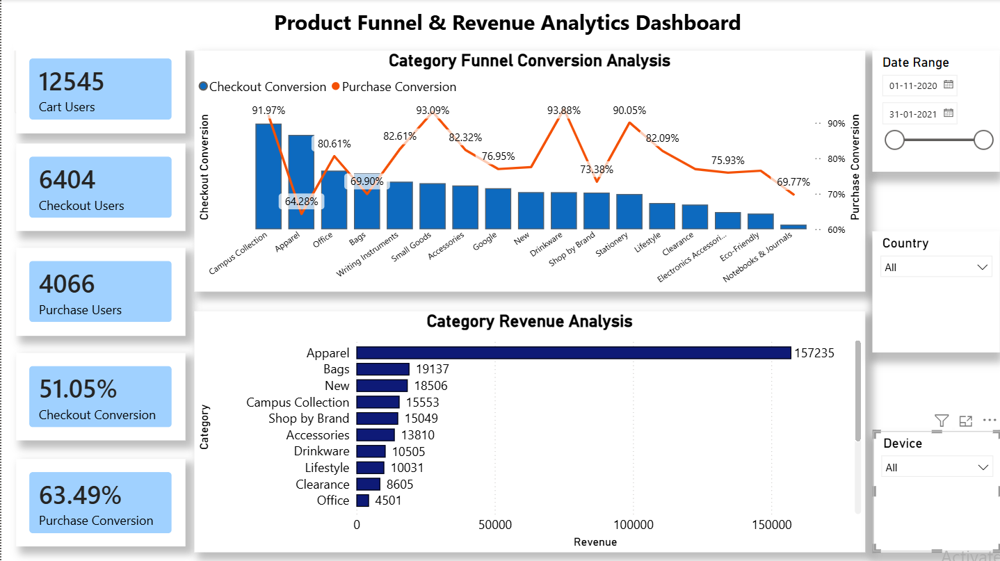
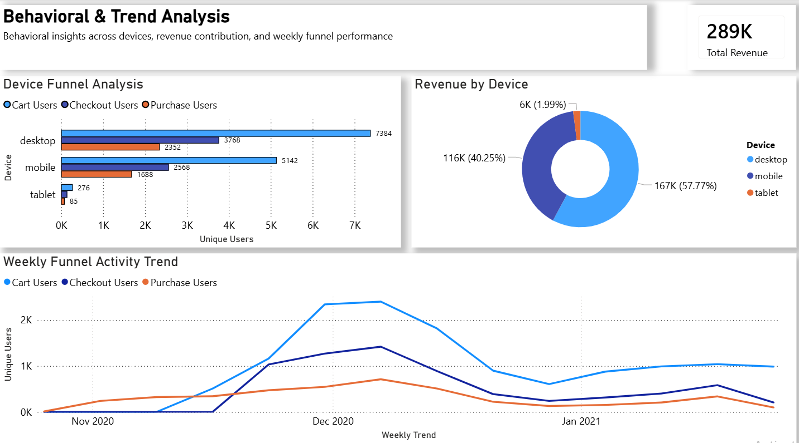

# 📊 Product Funnel & Revenue Analytics Dashboard (Google Merchandise Sales Data)

## 📌 Project Overview

This project is an end-to-end **Product Funnel & Revenue Analytics solution** built using **Python, SQL, and Power BI**. The goal of the project is to analyze customer behavior across multiple stages of the ecommerce funnel, identify conversion drop-offs, evaluate revenue-driving categories, and generate actionable business insights through interactive dashboards.

The project follows a real-world analytics workflow where raw ecommerce event data is:

- Cleaned and transformed using Python
- Analyzed using SQL
- Visualized through Power BI dashboards

---

# 🎯 Business Problem

Ecommerce businesses generate massive amounts of user interaction data across:
- product views
- add to cart actions
- checkout stages
- purchases

However, understanding:
- where users drop off,
- which categories generate the most revenue,
- and how device behavior impacts conversions

requires structured analytical workflows and dashboarding.

This project aims to solve these business challenges through funnel analysis and behavioral analytics.

---

# 🚀 Project Objectives

✅ Analyze user behavior across the purchase funnel  
✅ Measure checkout and purchase conversion rates  
✅ Identify top-performing product categories  
✅ Analyze device-level user behavior  
✅ Track weekly funnel activity trends  
✅ Build interactive business dashboards  
✅ Handle data anomalies and threshold filtering  

---

# 🗂️ Dataset Information

The project uses three ecommerce datasets:

| Dataset | Description |
|---|---|
| `events.csv` | User interaction events such as add_to_cart, begin_checkout, and purchase |
| `items.csv` | Product-level information including category and price |
| `users.csv` | User and device-related information |

---

# 🛠️ Tools & Technologies Used

| Tool | Purpose |
|---|---|
| 🐍 Python | Data cleaning and exploratory analysis |
| 🐼 Pandas & NumPy | Data transformation and preprocessing |
| 🗄️ SQL (SQLite) | Funnel analysis and business logic |
| 📊 Power BI | Interactive dashboard creation |
| 📈 DAX | KPI and measure calculations |
| 📓 Jupyter Notebook | Python workflow execution |

---

# 🐍 Python Analysis

The Python workflow focused on:

- Data cleaning and preprocessing
- Handling missing values
- Exploratory data analysis
- Funnel behavior analysis
- Revenue and category exploration
- Exporting cleaned datasets for SQL and Power BI

### 🔍 Key Python Tasks
- Converted raw event data into analysis-ready datasets
- Identified category-level anomalies
- Validated funnel consistency
- Exported cleaned CSV files

---

# 🗄️ SQL Analysis

SQL was used to translate business logic into scalable analytical queries.

### 📌 Key SQL Analysis Performed

- Overall funnel analysis
- Checkout conversion calculations
- Purchase conversion calculations
- Category-level funnel analysis
- Revenue analysis by category
- Device-level behavior analysis
- Weekly funnel trend analysis
- Threshold filtering for low-volume categories

---

# ⚡ Advanced SQL Concepts Used

- CTEs (Common Table Expressions)
- Conditional Aggregation
- DISTINCT COUNT
- LEFT JOIN operations
- Revenue aggregation
- Weekly trend preprocessing
- Conversion calculations

---

# 📊 Power BI Dashboard

The Power BI dashboard provides executive-level visibility into:
- funnel performance
- revenue trends
- behavioral analysis
- device-level insights

---

# 📌 Dashboard Features

## 📈 Executive Funnel Overview
- KPI cards
- Funnel conversion analysis
- Revenue analysis by category
- Dynamic slicers

## 📉 Behavioral & Trend Analysis
- Device funnel comparison
- Revenue by device
- Weekly funnel activity trend
- Interactive filtering

---

# 🖼️ Dashboard Screenshots

## 📌 Executive Funnel Overview



---

## 📌 Behavioral & Trend Analysis



---

# 🔑 Key Insights

## 🛒 Funnel Performance
- Over **12K users** added products to cart
- Approximately **4K users** completed purchases
- Significant drop-offs were observed between checkout and purchase stages

---

## 💰 Revenue Insights
- **Apparel** generated the highest revenue
- **Bags** showed strong revenue contribution despite lower funnel traffic
- Low-volume categories produced inflated conversion rates and required threshold filtering

---

## 📱 Device Behavior
- Desktop users contributed the highest revenue and engagement
- Mobile users showed high activity but lower purchase completion
- Tablet traffic remained minimal

---

## 📅 Trend Analysis
- Funnel activity peaked during the holiday season
- Weekly aggregation provided cleaner business insights compared to daily-level granularity
- User engagement declined gradually post-holiday season

---

# 💡 Business Recommendations

✅ Optimize mobile checkout experience  
✅ Improve final-stage purchase conversion  
✅ Prioritize high-performing categories for promotions  
✅ Apply threshold filtering for low-volume segments  
✅ Monitor weekly trends for seasonal demand spikes  

---

# ⚠️ Challenges & Problem Solving

During the project, several real-world analytical challenges were encountered and solved:

- Inflated conversion rates caused by low-volume categories
- Funnel inconsistencies due to join logic
- DISTINCTCOUNT performance limitations in Power BI
- Time-series visualization optimization
- SQL pre-aggregation for dashboard performance improvement

These optimizations improved both:
- analytical accuracy
- dashboard efficiency

---

# 📂 Folder Structure

```bash
product-funnel-growth-analytics/
│
├── data/
│   ├── events1.csv
│   ├── items.csv
│   └── users.csv
│
├── python/
│   ├── FunnelAnalysis.ipynb
│   ├── cleaned_events.csv
│   ├── cleaned_items.csv
│   └── cleaned_users.csv
│
├── sql/
│   ├── funnel_analysis.sql
│   ├── category_analysis.sql
│   ├── revenue_analysis.sql
│   └── weekly_trend_analysis.sql
│
├── powerbi/
│   └── product_funnel_dashboard.pbix
│
├── images/
│   ├── executive_dashboard.png
│   └── behavioral_dashboard.png
│
├── requirements.txt
└── README.md
```

---

# 🎯 Final Outcome

This project demonstrates a complete analytics workflow from:
- raw data processing
- SQL analysis
- business intelligence reporting
- dashboard storytelling

using industry-standard analytics tools.

The project highlights:
- analytical thinking
- SQL proficiency
- dashboard design
- business-oriented problem solving
- performance optimization

---

# 👨‍💻 Author

## Sarthi Khator

If you found this project interesting, feel free to connect, fork the repository, or provide feedback ⭐
